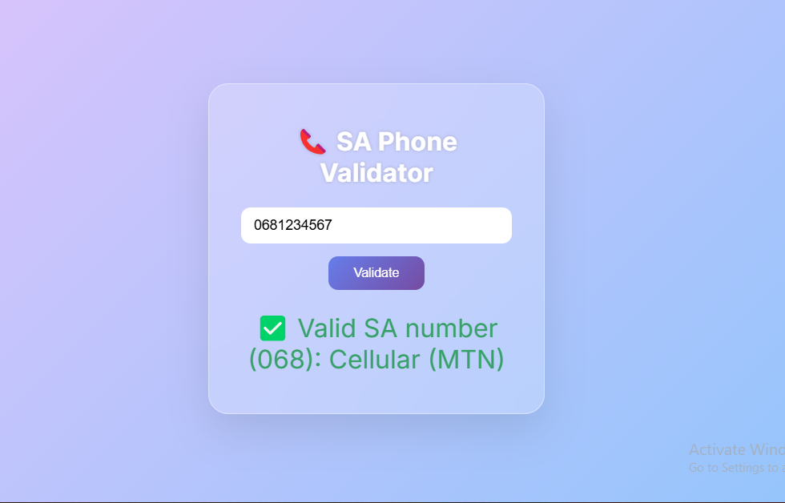
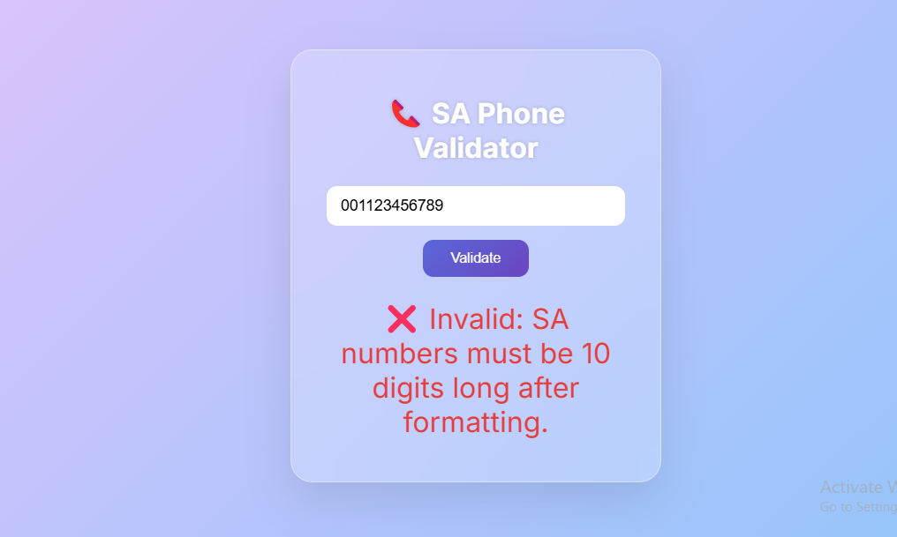
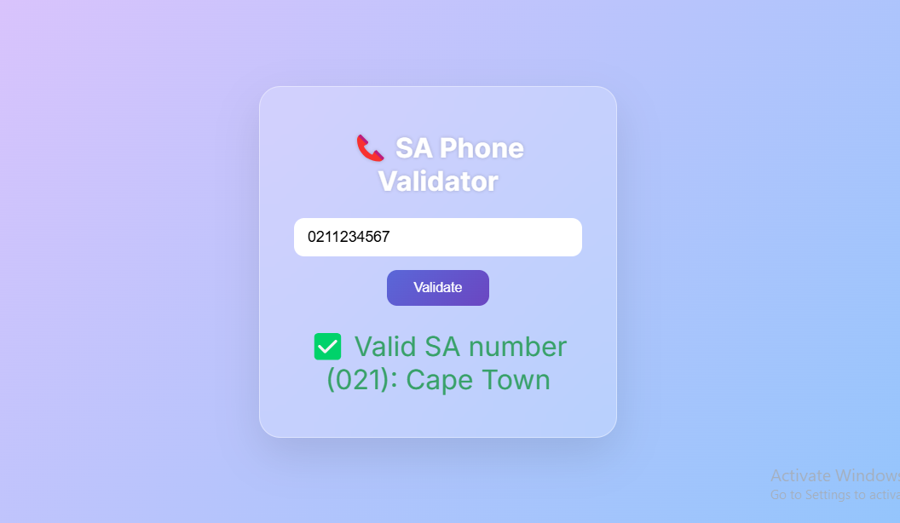
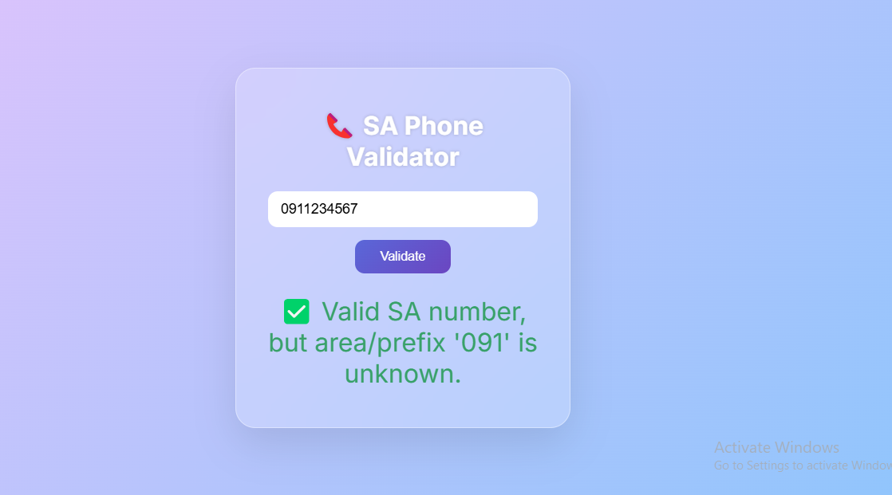

# South African Phone Number Validator

This project provides a clean and user-friendly web interface to validate South African phone numbers. It supports local and international formats and displays information about the area or network provider based on the phone number prefix.

---

## Features

- Validates SA phone numbers starting with `0`, `+27`, or `0027`.
- Accepts 10-digit local format or 11-digit international format (normalized).
- Detects and displays area codes for landlines and cellular network providers.
- Shows a success message for unknown but valid SA prefixes.
- Responsive and minimalistic design for great user experience.
- Validation triggered by button click or pressing Enter key.

---

## Screenshots

### Invalid SA Number

### Valid Area Code

### Valid Network Provider

### Valid Unknown Prefix

---

## Usage

1. Open `index.html` in your browser.
2. Enter a South African phone number in the input field.
3. Press **Validate** or hit **Enter**.
4. See validation results with details about the number’s origin.

---

## Supported Prefixes

- Landline area codes (e.g., `011` for Johannesburg, `021` for Cape Town)
- Cellular network prefixes (e.g., `068` for MTN, `082` for Vodacom)
- Other shared service and VoIP prefixes

---

## Development

Feel free to contribute or customize the area code mappings in `script.js`.

---

## License

MIT License © Musa Dondolo
